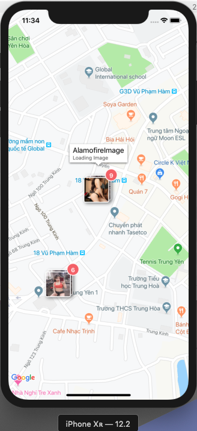

Google Maps for iOS Sample: Adding a Marker Complex
==========================================================

1. Download my repository
2. Run pod install in your current folder after download
3. Clean build
4. Run & Enjoy

# Demo [Click to image to view on Youtube link]

